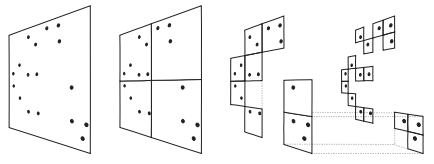
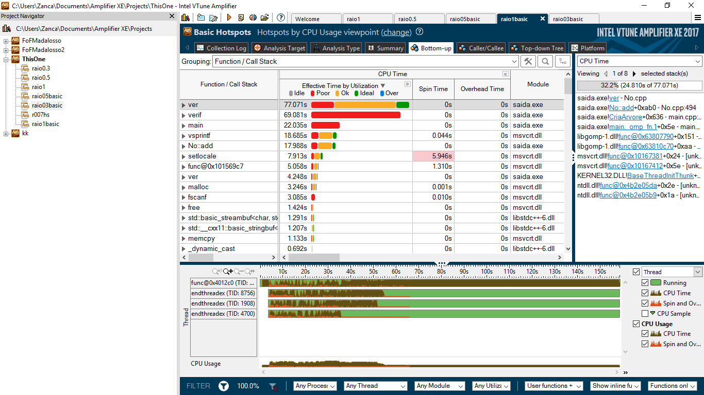
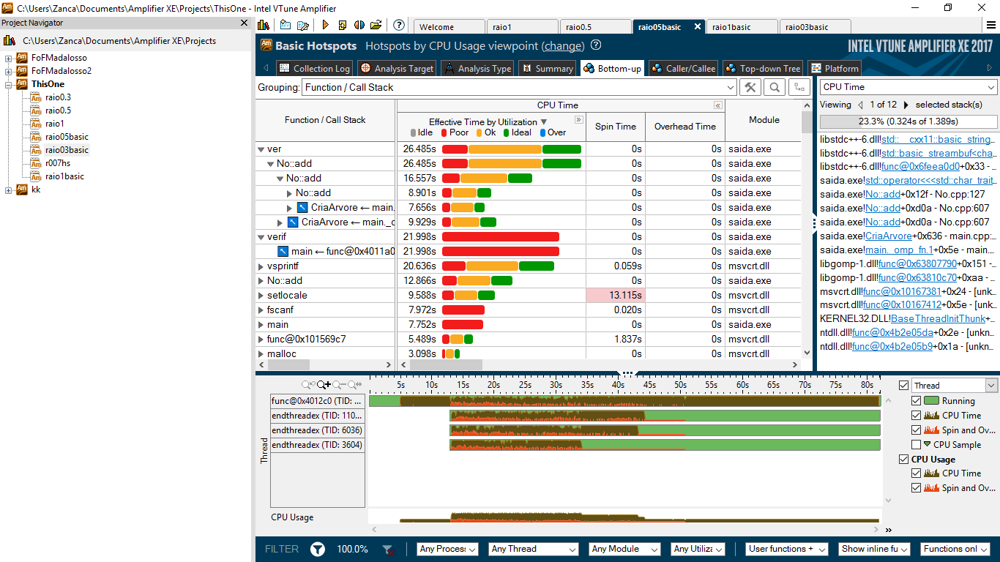
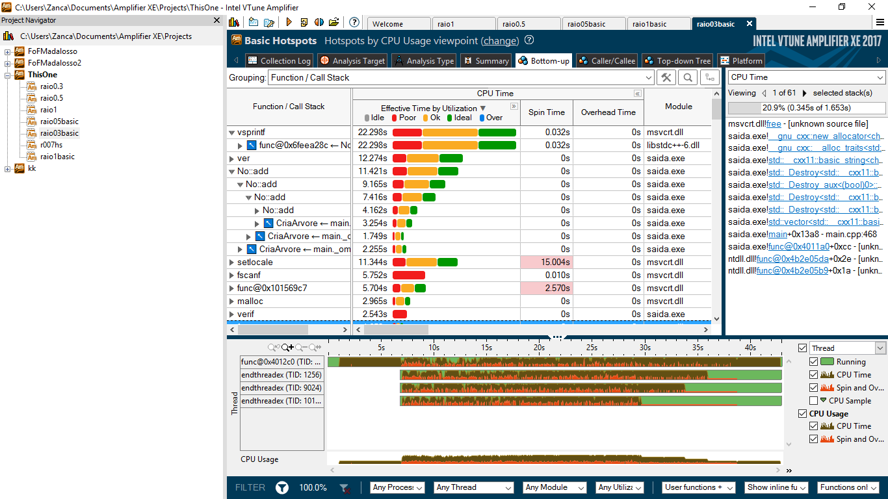
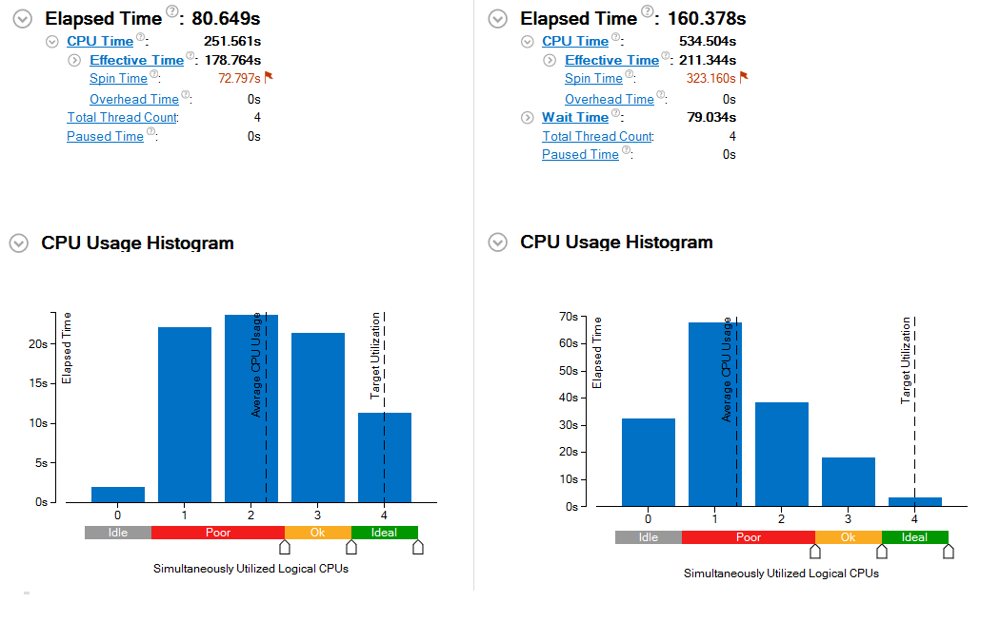

**Diogo João Cardozo, Eric Tomás Zancanaro**

**Programação de Alto Desempenho - PPGI UFSM**

**Profª Andrea Schwertner Charão**

##Sobre o programa

Este programa trabalha de forma similar ao algoritmo analisado anteriormente, realizando o agrupamento de partículas com base em um raio de percolação, utilizando a técnica Friends of Friends para concretizar o agrupamento. 

Como entrada, o programa recebe um arquivo com coordenadas de partículas e um raio de percolação, utilizado como base para a categorização das partículas em grupos.

O algoritmo foi implementado na linguagem C++ e utiliza vetores simples para o armazenamento dos dados das partículas. Mais especificamente, o algoritmo possui oito vetores de tamanho **N**, para cada coordenada das partículas no espaço 3D, um vetor para cada coordenada da velocidade das partículas e dois vetores de classificação: identificador da partícula e índice do grupo.

Através do arquivo de entrada, o algoritmo popula os vetores de coordenadas das partículas seguindo a ordem pela qual as partículas são descritas linha a linha no arquivo, adicionando o valor 0 ao índice de grupo da partícula, representando que ela ainda não foi agrupada.

Este é o ponto em que o algoritmo difere largamente do funcionamento simplificado do programa anterior. Neste caso, foram utilizadas árvores para armazenar as partículas quando do seu agrupamento, bem como classes específicas implementadas para representar cada uma das partículas e seu agrupamento.

Em seguida serão descritas as classes presentes neste programa.

### Grupo.cpp
	
Classe que representa os grupos formados durante o algoritmo. Armazena um valor *int* representativo do identificador do grupo e um vetor de ponteiros para os corpos membros deste grupo.

Além do construtor, esta classe implementa também um método para adicionar novos corpos no grupo.

### Tupla.cpp

Classe simples com o propósito de implementar a estrutura de tuplas na linguagem c++. Armazena uma combinação de *int* com Segmento, representando o número de grupos presente em cada segmento do espaço tridimensional.

O único método presente nesta classe é um construtor.

### Segmento.cpp

A classe segmento representa uma fração do espaço tridimensional que engloba os corpos analisados. Armazena uma árvore que representaria os corpos presentes nesta fração do espaço, bem como um vetor de grupos contendo os grupos daquele segmento.

Esta classe não possui métodos implementados.

### Corpo.cpp

A classe corpo representa um dos objetos sendo agrupados pelo programa. Esta classe armazena valores *float* representativos das coordenadas **x**,**y** e **z** do objeto, bem como dois valores *int* representativos dos identificadores do objeto e do grupo ao qual ele foi alocado.

Apenas o construtor foi implementado nesta classe.

### No.cpp

Esta classe é a mais complexa do programa, tanto que é aqui que o algoritmo realiza a primeira passagem de testes para o agrupamento Friends of Friends. A classe representa um nó da árvore mencionada na classe Segmento e armazena um ponteiro para um Corpo, valores *float* representativos de coordenadas máximas e mínimas, valores *float* representando valores máximos e mínimos para que um corpo encontre-se na **fronteira do corpo apontado por este nó. Armazena ainda valores *bool* que indicam se o nó é ou não populado e se possui o menor raio. Possui ainda um vetor de Nós com 8 posições denominado filhos. Por fim armazena dois valores *int* que representam o identificador do nó e o número de grupos.

Os métodos implementados nesta classe são:
#### ver
Verifica a distância entre dois corpos através da fórmula distância = sqrt((c1.x-c2.x)² + (c1.y-c2.y)² + (c1.z-c2.z)²)

#### add
Adiciona um novo nó na subárvore. O processo de inclusão de um novo nó na árvore dá início aos testes de verificação de agrupamento dos corpos, logo seu funcionamento será discutido em detalhes em uma seção subsequente quando discutimos o funcionamento concreto deste programa.

#### relabel
Faz a troca do identificar de grupo de um determinado nó caso o algoritmo determine que o mesmo tenha sido alocado a um grupo que, na realidade, é subgrupo de um agrupamento maior.	

## Funcionamento do Algoritmo

A proposta básica do algoritmo é subdividir o espaço tridimensional que engloba os corpos e realizar o agrupamento em cada um destes segmentos de forma individual, realizando ao final a comparação dos corpos nas extremidades destes segmentos para verificar se existem grupos com corpos em mais de um segmento.

Para fazer a divisão, o algoritmo calcula as coordenadas máximas e mínimas de todos os corpos da entrada, circundando os objetos com um cubo virtual. Sabendo os valores da extremidade, o algoritmo calcula também valores medianos para cada coordenada da forma [min + ((max - min) / 2)]. Com estes valores medianos, é feita uma divisão em 8 semi-cubos, denominados de segmentos.

Com estes segmentos determinados, a entrada é então dividida em função das coordenadas dos corpos ali representados, de forma que cada um seja alocado a um destes segmentos. Com a entrada dividida, inica-se a criação das árvores que armazenarão os corpos e realizarão o agrupamento dos mesmos. Como o espaço foi dividido em 8 segmentos, serão criadas 8 árvores individuais, o que permite a paralelização deste fragmento do programa. 

A criação destas árvores continua a segmentação do espaço tridimensional, criando, para cada semi-cubo obtido anteriormente, 8 novos semi-cubos, de forma que o último semi-cubo criado contenha apenas 1 corpo em seu interior. Estas árvores são descritas como *oct-trees* devido a esta propriedade. Uma visualização em 2 dimensões ajuda a compreender o processo de divisão realizado por estas árvores e é encontrado na imagem obtida do artigo (Springel et al.).

Sabemos que o programa divide os corpos em segmentos e que o agrupamento é primeiramente realizado de forma independente em cada um destes fragmentos do espaço. Este agrupamento é realizado durante a inclusão de um novo corpo na árvore existente dentro de cada segmento. Antes de explicar o processo de adição dos nós, é necessário porém que expliquemos o conceito de **fronteira** no âmbito deste algoritmo, já que o mesmo aparecerá durante o texto.

####Fronteira

Sabemos pela definição da palavra que fronteira é uma região que encontra-se nos limites entre duas áreas. Neste algoritmo não é diferente, a área de fronteira é toda aquela próxima o suficiente dos limites do segmento no qual o corpo se encontra. Esta definição levanta a questão de como definimos qual distância representa próxmia o suficiente dos limites. Para o propósito tratado aqui, um corpo está próximo o suficiente dos limites de um segmento quando existe a possibilidade de que este corpo seja agrupado com um corpo de fora deste segmento. Em termos matemáticos: 

Considerando um espaço 3D, onde **limX**,**limY** e **limZ** representam os limites de um segmento dentro deste espaço e **r** é um raio qualquer, um objeto de coordenadas (x,y,z) encontra-se próximo o suficiente dos limites quando: *_(x + raio >= limX)_* OU *_(y + raio >= limY)_* OU *_(z + raio >= limZ)_*.

Conhecendo a aplicação de fronteira neste programa, podemos partir para o funcionamento do restante do código. De início, são calculados os valores máximos e mínimos locais para as coordenadas dos corpos do segmento. Estes valores servem também para o cálculo dos limites da área de fronteira (max - raio e min + raio). Têm-se início a construção da árvore, através da instanciação de um objeto Corpo para representar o objeto da entrada, bem como de um objeto No contendo um ponteiro para tal Corpo, utilizando como raiz da árvore o primeiro corpo analisado. Caso este corpo esteja na fronteira do segmento, é alocado no vetor de fronteira da árvore. Segue um laço que cria um objeto Corpo para cada objeto da entrada e o adiciona na árvore através do método *add da classe No.

####Adicionando nós na árvore

É sensato lembrar aqui que cada nó da árvore possui sua área de fronteira, já que cada nível dela representa uma subdivisão em um espaço cada vez menor. O método add pode agir de forma recursiva, iniciando no nó raíz da árvore e a percorrendo para encontrar a posição na qual um corpo deve ser alocado.

Para cada corpo adicionado a árvore, seguem-se os testes realizados para o seu posicionamento:
O algoritmo testa se o raio é maior que as coordenadas do cubo, o que significa que o corpo está envolto em um segmento muito pequeno.
Neste caso, são feitos testes com os nós já armazenados na fronteira do nó ao qual este é anexado, comparando as distâncias de forma a agrupar os nós caso estejam próximos. Este nó é então adicionado a fronteira e marcado como não populado, ou seja, não possuirá nós filhos. Executando estes passos, o método add retorna ao ponto em que foi chamado.

Caso o corpo não tenha caído no caso acima, o algoritmo testa então se este corpo está na fronteira do nó ao qual será anexado. Caso esteja, ele é adicionado ao vetor de fronteira.

Caso o corpo esteja sendo anexado a um nó populado, o algoritmo calcula os limites da próxima subdivisão de acordo com as coordenadas do corpo, de forma a determinar em qual dos 8 subespaços este corpo será alocado. Neste caso, será criado um nó representante deste corpo (chamamos nó2, para evitar confusão), alocado como um filho do nó populado, na posição determinada pelo passo anterior. Testa-se também se o corpo encontra-se na fronteira deste novo nó criado, sendo alocado na fronteira deste em caso positivo. O algoritmo marca ainda o nó original como não populado.

A seguir, o algoritmo calcula em qual subdivisão o corpo deverá ser alocado (se o nó já é populado, esse passo acontece repetido). Caso já exista um filho na posição calculada, verifica-se se o novo corpo está na região de fronteira deste filho, alocando uma flag *true* em caso positivo.

O algoritmo verifica o agrupamento entre todos os corpos vizinhos do novo corpo sendo alocado a árvore, modificando os identificadores de grupo quando necessário. Caso o corpo tenha sido detectado como de fronteira em algum dos passos anteriores, verifica-se o agrupamento também com os nós da fronteira.

Caso não exista um filho na posição calculada, aloca-se um objeto nó para este corpo, são calculados os limites da sua subdivisão e se este corpo encontra-se na fronteira da sua subdivisão. Este novo nó é então alocado como filho do nó original na posição calculada. Caso já exista um filho, o algoritmo tenta adicionar este corpo no nó filho através da função add. 

##Sobre os testes                

Os testes foram executados em uma máquina com as seguintes configurações:

- Processador: Intel Xeon CPU ES620 @2.40GHz 8 cores;
- Sistema operacional: Debian 3.2.73-2+deb7u2 x86_64 GNU/Linux;
- Memória RAM: 12Gb. 

Foram executados testes com o mesmo arquivo de entrada, que apresenta 318133 partículas, utilizando como raio de percolação os valores: 2,4,16,32. Para uma melhor representação dos tempos, foram realizadas 4 execuções de cada método e compilado um valor médio para o tempo de cada.

| Raio | FoFOriginal(s)| Serial(s)  | 8 Threads(s) | 4 Threads(s) | 2 Threads(s)
|:----:| ------------: |-----------:|------------: | -----------: | -----------:
| 1    |  954,832650   | 368,271043 |252,2598610   |  209,4751176 | 242,950574
| 0,50 | 1161,413917   | 137,098786 |73,6095873    |   54,6247256 | 69,959858
| 0,3  | 1208,105630   | 76,0197616 |39,7229296*   |  27,4431996* | 30,1550143333 

A tabela abaixo apresenta o Speedup encontrado com cada configuração de parâmetros:

 N threads |Raio 1    | Raio 0,5 | Raio 0,3
 :--------:| --------:| --------:|----------:
 	8	   |1,4599    | 1,8625   | 1,9138 
 	4	   |1,7581    | 2,5098   | 2,7701
 	2	   |1,5158    | 1,9596   | 2,5210

*Das 3 execuções usadas para calcular a média, a primeira obteve um tempo de execução de 50% maior que as restantes.
Observando a tabela de resultados, pode-se concluir que o tempo da execução serial sofre muito com um raio menor. Já as execuções com Threads obtiveram um desempenho muito melhor, esse ganho se dá ao fato da grande palelização dos cálculos. Entretanto, os testes com 4 threads foram melhores que os de 8. Sendo assim, para otimizar de forma melhor ainda o resultado do algoritmo deve-se levar em consideração o balanço entre desempenho e custo.

Os resultados do agrupamento realizado por este algoritmo diferem radicalmente dos resultados encontrados com a execução do algoritmo original analisado anteriormente, não só na questão tempo, mas também na questão grupos. A tabela abaixo evidencia a diferença presente no agrupamento de ambos os algoritmos.

|Raio|Nº de grupos Original | Nº de grupos novo|
|:--:|:--------------------:|:----------------:|
|  1 | 25772				   |   20917
| 0.5| 64502				   |   60393
| 0.3| 94914				   |   90301

É evidente pela tabela que os algoritmos não realizam o mesmo agrupamento, embora as partículas e o raio de entrada sejam exatamente iguais. Esta discrepância pode apontar que existem erros na realização do agrupamento de um dos algoritmos, visto que a técnica Friends of Friends deveria garantir sempre um agrupamento constante para um conjunto de dados e um determinado raio. Como explicar este comportamento?

##Profiling 

Abaixo encontram-se algumas imagens referentes ao *profiling* da aplicação realizado através do software *Intel VTune Amplifier*.

Sumário da execução do algoritmo. Similar para todas as execuções.

O sumário da execução do algoritmo já apresenta de cara um fator prejudicial a performance: o tempo em que os 4 *cores* de processamento executam simultâneamente é curto, enquanto o tempo em que apenas um *core* trabalha é alto. Isto pode indicar que a paralelização do código não está sendo tão efetiva quanto deveria ser. Cabe uma análise da paralelização feita e como ela pode ser alterada para que a carga seja melhor balanceada entre todos os *cores*.

Profile da aplicação com raio = 1.

Profile da aplicação com raio = 0,5.

Profile da aplicação com raio = 0,3.

Nas imagens obtidas através do *profiling* da aplicação, obtivemos dois padrões de execução. Um padrão repetiu-se para as excecuções com raio 0.5 e raio 1, enquanto o segundo padrão apareceu na execução onde o valor do raio era 0.3.

No primeiro padrão, podemos ver que o tempo de execução da mesma concentra-se nas funções **ver** e **verif**. Outras funções que demonstrar alto tempo de execução foram, sem ordenamento: **vsprintf**, **main** e **No:add**. As primeiras duas funções são responsáveis por calcular a distância entre dois pontos através da fórmula algébrica comum, a diferença entre elas é que a função **ver** é chamada durante a inclusão de nós na árvore do programa, mais especificamente dentro do método **add** da classe **No**, o qual age recursivamente. Existem três chamadas a esta função durante a inclusão de um nó na árvore: 

1. Dentro de um laço for quando o raio desejado é maior do que o semicubo que engloba o ponto, de forma que o ponto deve ser incluído na área de fronteira daquele cubo e sua distância com outros pontos fronteiriços comparada para o agrupamento.
2. Quando o ponto é adicionado a árvore em algum quadro do seu nó pai. Aqui a função é chamada dentro de um laço for que abrange todos os corpos vizinhos a ele, ou seja, todos os filhos do seu nó pai (8 neste algoritmo).
3. Dentro do laço for descrito acima, existe um segundo laço abrangendo todos os nós pertencentes a fronteira do filho sendo examinado no laço acima. Para cada execução deste laço existe uma chamada a função **ver**. 

A função **verif**, por sua vez, é chamada na **main** do programa, quando o algoritmo realiza a comparação das fronteiras dos segmentos. Esta função é chamada dentro de um laço executado para comparar todos os pontos da região de fronteira.

É interessante observar a diferença nos tempos de execução da função **ver** com os diferentes valores de raio:

1. Com raio 1, o tempo de execução foi 77,071s.
2. Com raio 0,5, o tempo foi 26,485s.
3. Com raio 0,3, o tempo total foi 12,274s.
A explicação do algoritmo, bem como das chamadas da função já explica este fenômeno, pois a função é chamada diversas vezes para comparações com pontos que estão nas zonas de fronteira e, quando o raio é maior, aumenta o número de pontos que serão alocados na fronteira de um semi-cubo.

Considerando apenas estas duas funções, uma alternativa para melhorar o desempenho seria otimizar a execução do cálculo da distância ou diminuir o número de vezes em que esta função é chamada. A primeira opção apresenta dificuldades técnicas, pois o algoritmo precisaria implementar técnicas para o cálculo de raiz quadrada que superem o desempenho já otimizado das instruções dos processadores modernos.

A segunda opção parece mais viável. No algoritmo atual, uma partícula é testada contra todos seus vizinhos, mesmo aqueles que pertencem ao mesmo grupo ao qual ela foi alocada, cálculo desnecessário. Evitando estes cálculos poderíamos obter uma melhoria no desempenho do algoritmo, especialmente em espaços onde as partículas encontram-se mais concentradas.

##Concurrency Analysis

Nas opções de análises do *Intel VTune Amplifier* exite o Concurrency, que pela descrição deverá mostrar como a aplicação está utilizando CPUs lógicas disponíveis, e onde o paralelismo está demonstrando problemas.

Foi executado o mesmo algoritmo com 4 threads, mesmos dados de entrada e raio de percolação 1. Com a análise concurrency, é possível observar uma grande perda na utilização dos cores, utilizando por bem pouco tempo os 4 em paralelo. Porém um detalhe a observar é que o tempo de execução total foi maior que a análise Basic, um dos fatores a levar em consideração na análise Concurrency é adicionado um overhead na execução da aplicação, o que pode levemente influenciar no tempo total de execução. A imagem abaixo mostra o Summary e a utilização de threads da análise **Base** versus **Concurrency**.

##Referências

SPRINGEL, Volker; YOSHIDA, Naoki; WHITE, Simon DM. GADGET: a code for collisionless and gasdynamical cosmological simulations. New Astronomy, v. 6, n. 2, p. 79-117, 2001. [Link](http://arxiv.org/pdf/astro-ph/0003162v3.pdf)
