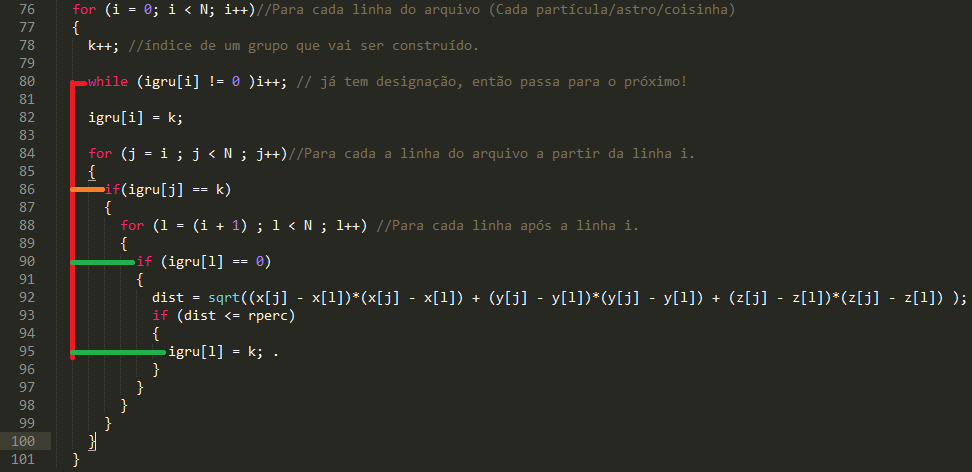

**Diogo João Cardozo, Eric Tomás Zancanaro**

**Programação de Alto Desempenho - PPGI UFSM**

**Profª Andrea Schwertner Charão**

##Sobre o programa##

O programa utilizado realiza o agrupamento de partículas com base em um raio de percolação, utilizando a técnica Friends of Friends para concretizar o agrupamento. O funcionamento deste programa foi descrito no link:

Neste texto explicamos a tarefa de paralelizar este algoritmo em busca de uma melhoria na performance. Para tal foi utillizada a ferramenta OpenMP, que facilita a inclusão de seções paralelas em um código já existente.

A maior parte do tempo de processamento deste programa ocorre na função de agrupamento das partículas, logo este é o ponto que será analisado na paralelização do código. Por tratar-se de um bloco de código composto por três laços for aninhados, é necessária a análise das computações ocorridas dentro de cada um destes laços para garantir a paralelização adequada do processo.

Existem três alternativas para uma paralelização simples deste código, sem alterações drásticas no algoritmo:
	- Paralelizar todos os três laços.
	- Paralelizar os dois laços internos.
	- Paralelizar apenas o laço mais interno.

A primeira alternativa pode ser facilmente eliminada através da análise do início do primeiro laço. Neste trecho de código vemos que uma partícula é selecionada e, caso ainda não tenha grupo, é alocada como a primeira partícula de um novo grupo k. Assim sendo, não podemos alocar dois grupos diferentes de maneira "simultânea", visto que é possível que ambas as partículas selecionadas pertençam a um mesmo grupo. Esta paralelização incorreria em um resultado incorreto do algoritmo, com uma quantidade exagerada de grupos.

Já a segunda alternativa parece mais interessante. A primeira vista, pensamos que esta parcela da computação poderia ser executada em paralelo sem que houvesse alteração do resultado do algoritmo. Em uma primeira tentativa de paralelização, obtivemos uma melhoria extremamente significativa na performance, porém, o resultado do algoritmo não era coerente com o resultado obtido na execução serial. Com uma segunda análise do código, fica evidente a causa de tal incoerência de resultados.

A imagem apresenta as dependências presentes entre os três laços do programa. Nela, vemos que os testes realizados para determinar a qual grupo a partícula pertence são dependentes da execução do laço mais interno. Ou seja, a segunda iteração do segundo laço (laranja) do trecho  só pode acontecer após a execução correta do terceiro laço (verde). Assim, nos resta a paralelização do laço mais interno do programa.

Para determinarmos se é possível ou não paralelizar o laço interno, basta observar as computações realizadas dentro deste e, caso não exista dependência de ordem na execução destas, podemos sim paralelizar a execução deste laço. É simples verificar que não existe dependência neste trecho, visto que cada iteração do laço realiza testes e modifica uma posição específica do vetor, de acordo com o valor do índice de iteração. Um cuidado especial é necessário porém com a variável **dist**, pois seu valor é alterado em cada iteração, logo quando utilizamos threads, poderia haver conflitos de escrita e leitura. Como o resultado desta alteração só é relevante para a iteração corrente do laço, podemos ter uma cópia desta variável para cada iteração e o resultado seria o mesmo.

Assim sendo, a paralelização foi realizada apenas no laço mais interno do trecho do programa que realiza o agrupamento, tomando o cuidado necessário com a variável **dist**.

##Sobre os testes##                

A paralelização foi realizada com a diretiva #pragma omp parallel for, utilizando diferentes tipos de **scheduling** e criando uma variável LocalDist para garantir a segurança do cálculo da distância pelas threads.

O primeiro teste foi feito utilizando-se um **schedule** estático. Com este parâmetro, a divisão do trabalho das threads é realizada em tempo de compilação e cada uma delas fica responsável pela execução de uma carga similar de trabalho.

O segundo utiliza um **schedule** dinâmico. Aqui a divisão é feita em diversos blocos de trabalho iguais, de acordo com um tamanho de bloco selecionado pelo programador. Com este escalonamento, cada thread recebe um bloco de trabalho para executar, recebendo novo bloco quando termina seu encargo.

O terceiro teste utilizou um **schedule** guiado. Este escalonamento é uma variação do escalonamento dinâmico, aonde os primeiros blocos de trabalho são grandes, enquando os posteriores vão diminuindo gradativamente de tamanho.

A hipótese trabalhada pela equipe para qual destes métodos terá o melhor desempenho foi:
 - O método estático deverá mostrar o pior desempenho, já que não há como prever a quantidade de trabalho realizada por cada iteração do laço, visto que o trabalho é composto basicamente por uma clásula **if**, seguida de operações matemáticas e um segundo **if**, é provável que boa parte das threads não executem o trabalho custoso: as operações matemáticas. Como o método estático distribui uma carga igualitária para todas as threads, existe uma possibilidade de existirem threads ociosas que recebam um maior número de iterações que acabem no primeiro **if**.
 - Os métodos dinâmico e guided devem apresentar desempenho similar, porém o método guided é mais confiável, visto que não é uma tarefa simples especificar o tamanho dos blocos de trabalho que otimizem o desempenho do escalamento dinâmico.

Os testes foram executados em uma máquina com as seguintes configurações, utilizando um total de 8 threads:

- ?.
- ?.
- Memória RAM:?. 

Foram executados testes com o mesmo arquivo de entrada, que apresenta 318133 partículas, utilizando como raio de percolação os valores: 2,4,16,32. Para uma melhor representação dos tempos, foram realizadas 4 execuções de cada método e compilado um valor médio para o tempo de cada.

Para a medição dos tempos de execução, foi utilizada a biblioteca *chronus* da linguagem C++, utilizando uma escala de microssegundos. Os resultados obtidos são mostrados na tabela abaixo, com a conversão do tempo em segundos para facilitar a visualização.

| Percolação |Tempo Serial(s)|Tempo Static(s)|Tempo Dynamic(s)|Tempo Guided(s)|Speedup Static|Speedup Dynamic|Speedup Guided|
| ---------- |:------------:| --------------:|---------------:|--------------:|:------------:|:-------------:|:------------:|
| 1          |  951,200419  | 341,902268     | 404,945830     | 291,681382    | 2.7821       | 2.3490        | 3.2610
| 2          |  938,704370  | 374,151177     | 475,690339     | 329,976507    | 2.5089       | 1.9733        | 2.8448  
| 4          | 813,345729   | 385,955238     | 473,674422     | 358,032609    | 2.1073       | 1.7171        | 2.2717
| 16         |  297,991135  | 191,651810     | 323,526933     | 197,016100    | 1.5548       | 0.9211        | 1.5125
| 32         |  219,565154  | 584,27846      | 266,237279     | 594,90657     | 0.3758       | 0.8247        | 0.3691

Os dados da tabela mostram que, para os testes realizados, o escalonamento guiado foi a melhor opção para 3 dos 5 valores para o raio de percolação. Já o escalonamento dinâmico foi o pior para 4 dos 5 testes, sendo batido pelas duas outras opções.

Estes resultados contrariam as expectativas iniciais, visto que o escalonamento estático apresentou um desempenho próximo do método guiado. O baixo desempenho do método dinâmico deve-se ao *overhead* existente na atribuição dos blocos as threads, o que indica que o tamanho de blocos escolhido para os testes foi muito pequeno. 

A hipótese que explica o baixo desempenho do método dinâmico é corroborada pelo desempenho do escalonamento guiado, aonde o tamanho dos blocos de trabalho é determinado pelo compilador. Este desempenho também corrobora parte da hipótese inicial sobre o desempenho, visto que a atribuição de blocos de trabalho para as threads executadas neste método foi melhor do que a atribuição de blocos fixos presente no método estático. 

##Links de referência##

https://software.intel.com/en-us/articles/efficient-parallelization

http://openmp.org/mp-documents/omp-hands-on-SC08.pdf
